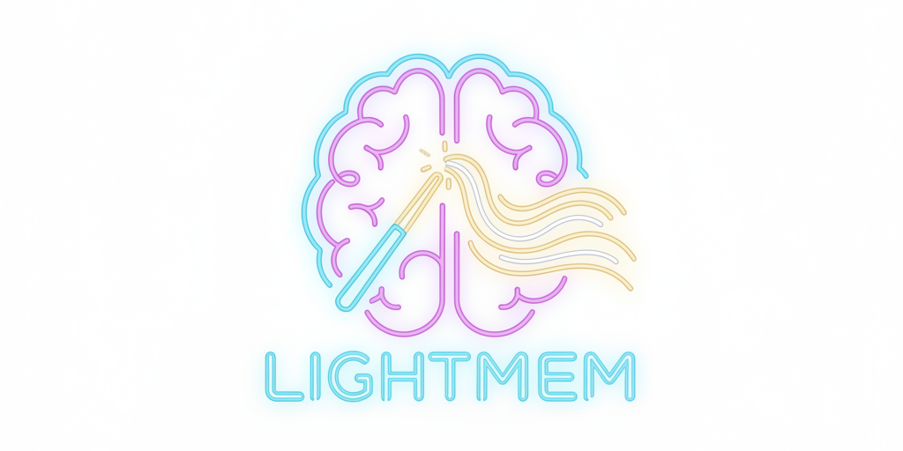
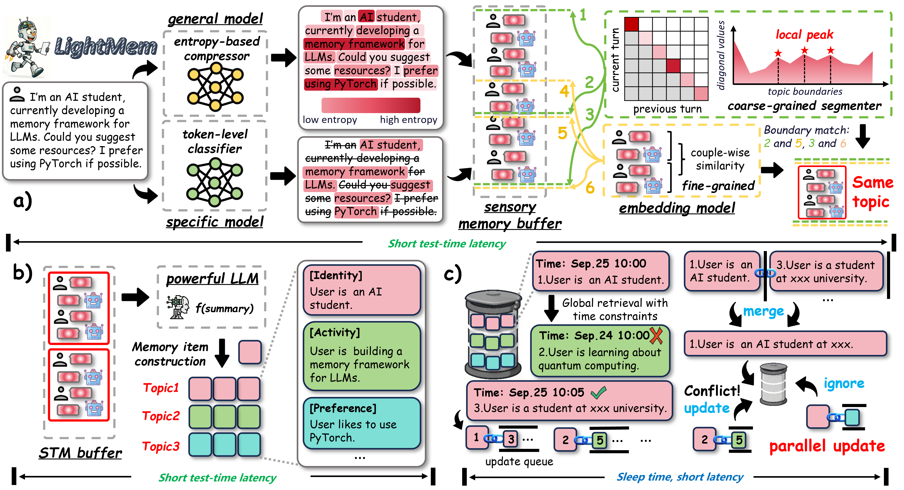

<div align="center">
  <picture>
    <source srcset="./figs/lightmem_logo_dark.png" media="(prefers-color-scheme: dark)">
    
  </picture>
</div>
<h1 align="center"> LightMem: Lightweight and Efficient Memory-Augmented Generation </h1>

<p align="center">
  <a href="https://arxiv.org/abs/2510.18866">
    
  </a>
  <a href="https://github.com/zjunlp/LightMem">
    
  </a>
  <a href="https://github.com/zjunlp/LightMem/blob/main/LICENSE">
    
  </a>
  
  
</p>

<h5 align="center"> ⭐ If you like our project, please give us a star on GitHub for the latest updates!</h5>

---

**LightMem** is a lightweight and efficient memory management framework designed for Large Language Models and AI Agents. It provides a simple yet powerful memory storage, retrieval, and update mechanism to help you quickly build intelligent applications with long-term memory capabilities.

* 🚀 **Lightweight & Efficient**
  <br> Minimalist design with minimal resource consumption and fast response times

* 🎯 **Easy to Use**
  <br> Simple API design - integrate into your application with just a few lines of code

* 🔌 **Flexible & Extensible**
  <br> Modular architecture supporting custom storage engines and retrieval strategies

* 🌐 **Broad Compatibility**
  <br> Support for cloud APIs (OpenAI, DeepSeek) and local models (Ollama, vLLM, etc.)

  <div align=center></div>

<span id='news'/>

## 📢 News

- **[2025-12-09]**: 🎬 Released a **[Demo Video](#demo)** showcasing long-context handling, along with comprehensive **[Tutorial Notebooks](./tutorial-notebooks/)** for various scenarios!
- **[2025-11-30]**: 🚌 LightMem now supports calling multiple tools provided by its [**MCP Server**](https://github.com/zjunlp/LightMem/blob/main/mcp/server.py).
- **[2025-11-26]**: 🚀 Added full **LoCoMo** dataset support, delivering strong [results](https://github.com/zjunlp/LightMem?tab=readme-ov-file#locomo) with leading performance and efficiency! Here is the [**reproduction script**](https://github.com/zjunlp/LightMem/blob/main/experiments/locomo/readme.md)!
- **[2025-11-09]**: ✨ LightMem now supports local deployment via [**Ollama**](https://github.com/zjunlp/LightMem/blob/main/src/lightmem/factory/memory_manager/ollama.py), [**vLLM**](https://github.com/zjunlp/LightMem/blob/main/src/lightmem/factory/memory_manager/vllm_offline.py), and [**Transformers**](https://github.com/zjunlp/LightMem/blob/main/src/lightmem/factory/memory_manager/transformers.py) auto-loading!
- **[2025-10-12]**: 🎉 LightMem project is officially Open-Sourced!


<span id='demo'/>

## 🎥 Demo & Tutorials

**Watch Demo:** [YouTube](https://www.youtube.com/watch?v=r7sk_7Yv66I) | [Bilibili](https://www.bilibili.com/video/BV1a7mJBbEVM/)

### 📚 Hands-on Tutorials
We provide ready-to-use Jupyter notebooks corresponding to the demo and other use cases. You can find them in the [`tutorial-notebooks`](./tutorial-notebooks/) directory.

| Scenario | Description | Notebook Link |
| :--- | :--- | :--- |
| **Travel Planning** | A complete guide to building a travel agent with memory. | [LightMem_Example_travel.ipynb](./tutorial-notebooks/LightMem_Example_travel.ipynb) |
| **Code Assistant** | A complete guide to building a code agent with memory. | [LightMem_Example_code.ipynb](./tutorial-notebooks/LightMem_Example_code.ipynb) |
| **LongMemEval** | A tutorial on how to run evaluations on LongMemEval benchmarks using LightMem. | [LightMem_Example_longmemeval.ipynb](./tutorial-notebooks/LightMem_Example_longmemeval.ipynb) |


<span id='reproduction'/>

## 🧪 Reproduction Scripts for LoCoMo & LongMemEval

We provide lightweight, ready-to-run scripts for reproducing results on **LoCoMo**, **LongMemEval**, and their combined baselines.

| Dataset                  | Description                                                                  | Script                                                                                                                                                                                                |
| :----------------------- | :--------------------------------------------------------------------------- | :---------------------------------------------------------------------------------------------------------------------------------------------------------------------------------------------------- |
| **LongMemEval**          | Run LightMem on LongMemEval, including evaluation and offline memory update. | [run_lightmem_gpt.py](https://github.com/zjunlp/LightMem/blob/main/experiments/run_lightmem_gpt.py) · [offline_update.py](https://github.com/zjunlp/LightMem/blob/main/experiments/offline_update.py) |
| **LoCoMo**               | Scripts for reproducing LightMem results on LoCoMo.                          | [run_lightmem_locomo.md](https://github.com/zjunlp/LightMem/blob/main/experiments/locomo/readme.md)                                                                                                   |
| **LongMemEval & LoCoMo** | Unified baseline scripts for running both datasets.                          | [run_baselines.md](https://github.com/zjunlp/LightMem/blob/main/src/lightmem/memory_toolkits/readme.md)                                                                                               |


<span id='todo'/>

## ☑️ Todo List
LightMem is continuously evolving! Here's what's coming:
    
- Offline Pre-computation of KV Cache for Update (Lossless)
- Online Pre-computation of KV Cache Before Q&A (Lossy)
- Integration More Models and Feature Enhancement
- Coordinated Use of Context and Long-Term Memory Storage
- Multi Modal Memory 


<span id='contents'/>

## 📑 Table of Contents

* <a href='#news'>📢 News</a>
* <a href='#demo'>🎥 Demo & Tutorials</a>
* <a href='#todo'>☑️ Todo List</a>
* <a href='#installation'>🔧 Installation</a>
* <a href='#quickstart'>⚡ Quick Start</a>
* <a href='#architecture'>🏗️ Architecture</a>
* <a href='#examples'>💡 Examples</a>
* <a href='#configuration'>⚙️ Configuration</a>
* <a href='#contributors'>👥 Contributors</a>
* <a href='#related'>🔗 Related Projects</a>

<span id='installation'/>

## 🔧 Installation

### Installation Steps

#### Option 1: Install from Source 
```bash
# Clone the repository
git clone https://github.com/zjunlp/LightMem.git
cd LightMem

# Create virtual environment
conda create -n lightmem python=3.11 -y
conda activate lightmem

# Install dependencies
unset ALL_PROXY
pip install -e .
```

#### Option 2: Install via pip
```bash
pip install lightmem  # Coming soon
```

## ⚡ Quick Start

1. Modify the `JUDGE_MODEL`, `LLM_MODEL`, and their respective `API_KEY` and `BASE_URL` in `API Configuration`.

2. Download `LLMLINGUA_MODEL` from [microsoft/llmlingua-2-bert-base-multilingual-cased-meetingbank](https://huggingface.co/microsoft/llmlingua-2-bert-base-multilingual-cased-meetingbank) and `EMBEDDING_MODEL` from [sentence-transformers/all-MiniLM-L6-v2](https://huggingface.co/sentence-transformers/all-MiniLM-L6-v2) and modify their paths in `Model Paths`.

3. Download the dataset from [longmemeval-cleaned](https://huggingface.co/datasets/xiaowu0162/longmemeval-cleaned), and modidy the path in `Data Configuration`.

```python
cd experiments
python run_lightmem_qwen.py
```

<span id='architecture'/>

## 🏗️ Architecture

### 🗺️ Core Modules Overview
LightMem adopts a modular design, breaking down the memory management process into several pluggable components. The core directory structure exposed to users is outlined below, allowing for easy customization and extension:

```python
LightMem/
├── src/lightmem/            # Main package
│   ├── __init__.py          # Package initialization
│   ├── configs/             # Configuration files
│   ├── factory/             # Factory methods
│   ├── memory/              # Core memory management
│   └── memory_toolkits/     # Memory toolkits
├── mcp/                     # LightMem MCP server
├── experiments/             # Experiment scripts
├── datasets/                # Datasets files
└── examples/                # Examples
```

### 🧩 Supported Backends per Module

The following table lists the backends values currently recognized by each configuration module. Use the `model_name` field (or the corresponding config object) to select one of these backends.

| Module (config)                 | Supported backends |
| :---                            | :--- |
| `PreCompressorConfig`           | `llmlingua-2`, `entropy_compress` |
| `TopicSegmenterConfig`          | `llmlingua-2` |
| `MemoryManagerConfig`           | `openai`, `deepseek`, `ollama`, `vllm`, etc. |
| `TextEmbedderConfig`            | `huggingface` |
| `MMEmbedderConfig`              | `huggingface` |
| `EmbeddingRetrieverConfig`      | `qdrant` |

<span id='examples'/>

## 💡 Examples

### Initialize LightMem
```python
import os
from datetime import datetime
from lightmem.memory.lightmem import LightMemory


LOGS_ROOT = "./logs"
RUN_TIMESTAMP = datetime.now().strftime("%Y%m%d_%H%M%S")
RUN_LOG_DIR = os.path.join(LOGS_ROOT, RUN_TIMESTAMP)
os.makedirs(RUN_LOG_DIR, exist_ok=True)

API_KEY='your_api_key'
API_BASE_URL='your_api_base_url'
LLM_MODEL='your_model_name' # such as 'gpt-4o-mini' (API) or 'gemma3:latest' (Local Ollama) ...
EMBEDDING_MODEL_PATH='/your/path/to/models/all-MiniLM-L6-v2'
LLMLINGUA_MODEL_PATH='/your/path/to/models/llmlingua-2-bert-base-multilingual-cased-meetingbank'

config_dict = {
    "pre_compress": True,
    "pre_compressor": {
        "model_name": "llmlingua-2",
        "configs": {
            "llmlingua_config": {
                "model_name": LLMLINGUA_MODEL_PATH,
                "device_map": "cuda",
                "use_llmlingua2": True,
            },
        }
    },
    "topic_segment": True,
    "precomp_topic_shared": True,
    "topic_segmenter": {
        "model_name": "llmlingua-2",
    },
    "messages_use": "user_only",
    "metadata_generate": True,
    "text_summary": True,
    "memory_manager": {
        "model_name": 'xxx', # such as 'openai' or 'ollama' ...
        "configs": {
            "model": LLM_MODEL,
            "api_key": API_KEY,
            "max_tokens": 16000,
            "xxx_base_url": API_BASE_URL # API model specific, such as 'openai_base_url' or 'deepseek_base_url' ...
        }
    },
    "extract_threshold": 0.1,
    "index_strategy": "embedding",
    "text_embedder": {
        "model_name": "huggingface",
        "configs": {
            "model": EMBEDDING_MODEL_PATH,
            "embedding_dims": 384,
            "model_kwargs": {"device": "cuda"},
        },
    },
    "retrieve_strategy": "embedding",
    "embedding_retriever": {
        "model_name": "qdrant",
        "configs": {
            "collection_name": "my_long_term_chat",
            "embedding_model_dims": 384,
            "path": "./my_long_term_chat", 
        }
    },
    "update": "offline",
    "logging": {
        "level": "DEBUG",
        "file_enabled": True,
        "log_dir": RUN_LOG_DIR,
    }
}

lightmem = LightMemory.from_config(config_dict)
```

### Add Memory
```python
session = {
"timestamp": "2025-01-10",
"turns": [
    [
        {"role": "user", "content": "My favorite ice cream flavor is pistachio, and my dog's name is Rex."}, 
        {"role": "assistant", "content": "Got it. Pistachio is a great choice."}], 
    ]
}


for turn_messages in session["turns"]:
    timestamp = session["timestamp"]
    for msg in turn_messages:
        msg["time_stamp"] = timestamp
        
    store_result = lightmem.add_memory(
        messages=turn_messages,
        force_segment=True,
        force_extract=True
    )
```

### Offline Update
```python
lightmem.construct_update_queue_all_entries()
lightmem.offline_update_all_entries(score_threshold=0.8)
``` 

### Retrieve Memory
```python
question = "What is the name of my dog?"
related_memories = lightmem.retrieve(question, limit=5)
print(related_memories)
``` 

### MCP Server

LightMem also supports the Model Context Protocol ([MCP](https://modelcontextprotocol.io/docs/getting-started/intro)) server:

```bash
# Running at Root Directory
cd LightMem

# Environment
pip install '.[mcp]'

# MCP Inspector [Optional]
npx @modelcontextprotocol/inspector python mcp/server.py

# Start API by HTTP (http://127.0.0.1:8000/mcp)
fastmcp run mcp/server.py:mcp --transport http --port 8000
```

The MCP config `json` file of your local client may looks like:

```json
{
  "yourMcpServers": {
    "LightMem": {
      "url": "http://127.0.0.1:8000/mcp",
      "otherParameters": "..."
    }
  }
}
```

## 📁 Experimental Results

For transparency and reproducibility, we have shared the results of our experiments on Google Drive. This includes model outputs, evaluation logs, and predictions used in our study.

🔗 Access the data here: [Google Drive - Experimental Results](https://drive.google.com/drive/folders/1n1YCqq0aDeWiPILhkq-uS3sU3FDmslz9?usp=drive_link)

Please feel free to download, explore, and use these resources for research or reference purposes.

<span id='configuration'/>

### LOCOMO: 

#### Overview

backbone: `gpt-4o-mini`, judge model: `gpt-4o-mini` & `qwen2.5-32b-instruct`

| Method             | ACC(%) gpt-4o-mini | ACC(%) qwen2.5-32b-instruct | Memory-Con Tokens(k) Total | QA Tokens(k) total | Total(k)     | Calls  | Runtime(s) total |
|-------------------|--------------------|------------------------------|-----------------------------|---------------------|--------------|--------|------------------|
| FullText          | 73.83              | 73.18                        | –                           | 54,884.479          | 54,884.479   | –      | 6,971           |
| NaiveRAG          | 63.64              | 63.12                        | –                           | 3,870.187           | 3,870.187    | –      | 1,884           |
| A-MEM             | 64.16              | 60.71                        | 11,494.344                  | 10,170.567          | 21,664.907   | 11,754 | 67,084          |
| MemoryOS(eval)    | 58.25              | 61.04                        | 2,870.036                   | 7,649.343           | 10,519.379   | 5,534  | 26,129          |
| MemoryOS(pypi)    | 54.87              | 55.91                        | 5,264.801                   | 6,126.111           | 11,390.004   | 10,160 | 37,912          |
| Mem0              | 36.49              | 37.01                        | 24,304.872                  | 1,488.618           | 25,793.490   | 19,070 | 120,175         |
| Mem0(api)         | 61.69              | 61.69                        | 68,347.720                  | 4,169.909           | 72,517.629   | 6,022  | 10,445          |
| Mem0-g(api)       | 60.32              | 59.48                        | 69,684.818                  | 4,389.147           | 74,073.965   | 6,022  | 10,926          |
| LightMem(512,0.7) | 71.95              | 73.90                        | 997.60                      | 4,008.243           | 5,005.851    | 415    | 12,831          |
| LightMem(768,0.7) | 70.26              | 72.40                        | 804.77                      | 3,958.228           | 4,763.005    | 295    | 11,643          |
| LightMem(768,0.8) | 72.99              | 74.35                        | 851.87                      | 4,012.034           | 4,863.900    | 298    | 12,423          |

backbone: `qwen3-30b-a3b-instruct-2507`, judge model: `gpt-4o-mini` & `qwen2.5-32b-instruct`

| Method             | ACC(%) gpt-4o-mini | ACC(%) qwen2.5-32b-instruct | Memory-Con Tokens(k) Total | QA Tokens(k) total | Total(k)     | Calls  | Runtime(s) total |
|-------------------|--------------------|------------------------------|-----------------------------|---------------------|--------------|--------|------------------|
| FullText          | 74.87              | 74.35                        | –                           | 60,873.076          | 60,873.076   | –      | 10,555           |
| NaiveRAG          | 66.95              | 64.68                        | –                           | 4,271.052           | 4,271.052    | –      | 1,252            |
| A-MEM             | 56.10              | 54.81                        | 16,267.997                  | 17,340.881          | 33,608.878   | 11,754 | 69,339           |
| MemoryOS(eval)    | 61.04              | 59.81                        | 3,615.087                   | 9,703.169           | 11,946.442   | 4,147  | 13,710           |
| MemoryOS(pypi)    | 51.30              | 51.95                        | 6,663.527                   | 7,764.991           | 14,428.518   | 10,046 | 20,830           |
| Mem0              | 43.31              | 43.25                        | 17,994.035                  | 1,765.570           | 19,759.605   | 16,145 | 46,500           |
| LightMem(768,0.4) | 64.09              | 60.84                        | 726.682                     | 5,151.393           | 5,878.075    | 174    | 9,638            |
| LightMem(768,0.6) | 71.36              | 69.03                        | 998.728                     | 5,220.252           | 6,218.980    | 291    | 10,541           |
| LightMem(1024,0.8)| 72.60              | 71.36                        | 1,084.465                   | 5,304.471           | 6,388.936    | 320    | 13,075           |


#### Details

backbone: `gpt-4o-mini`, judge model: `gpt-4o-mini` & `qwen2.5-32b-instruct`

| Method             | Summary Tokens(k) In | Summary Tokens(k) Out | Update Tokens(k) In | Update Tokens(k) Out | QA Tokens(k) In | QA Tokens(k) Out | Runtime(s) mem-con | Runtime(s) qa |
|-------------------|-----------------------|------------------------|----------------------|-----------------------|------------------|-------------------|----------------------|----------------|
| FullText          | –                     | –                      | –                    | –                     | 54,858.770       | 25.709            | –                    | 6,971          |
| NaiveRAG          | –                     | –                      | –                    | –                     | 3,851.029        | 19.158            | –                    | 1,884          |
| A-MEM             | 1,827.373             | 492.883                | 7,298.878            | 1,875.210             | 10,113.252       | 57.315            | 60,607               | 6,477          |
| MemoryOS(eval)    | 1,109.849             | 333.970                | 780.807              | 645.410               | 7,638.539        | 10.804            | 24,220               | 1,909          |
| MemoryOS(pypi)    | 1,007.729             | 294.601                | 3,037.509            | 924.962               | 6,116.239        | 9.872             | 33,325               | 4,587          |
| Mem0              | 8,127.398             | 253.187                | 12,722.011           | 3,202.276             | 1,478.830        | 9.788             | 118,268              | 1,907          |
| Mem0(api)         | \                     | \                      | \                    | \                     | 4,156.850        | 13.059            | 4,328                | 6,117          |
| Mem0-g(api)       | \                     | \                      | \                    | \                     | 4,375.900        | 13.247            | 5,381                | 5,545          |
| LightMem(512,0.7) | 731.89                | 201.29                 | 60.45                | 3.97                  | 3,997.984        | 10.259            | 8,484                | 4,347          |
| LightMem(768,0.7) | 575.36                | 189.24                 | 37.85                | 2.32                  | 3,948.124        | 10.104            | 7,378                | 4,265          |
| LightMem(768,0.8) | 628.20                | 179.53                 | 41.38                | 2.76                  | 4,001.759        | 10.275            | 8,153                | 4,270          |

backbone: `qwen3-30b-a3b-instruct-2507`, judge model: `gpt-4o-mini` & `qwen2.5-32b-instruct`

| Method             | Summary Tokens(k) In | Summary Tokens(k) Out | Update Tokens(k) In | Update Tokens(k) Out | QA Tokens(k) In | QA Tokens(k) Out | Runtime(s) mem-con | Runtime(s) qa |
|-------------------|-----------------------|------------------------|----------------------|-----------------------|------------------|-------------------|----------------------|----------------|
| FullText          | –                     | –                      | –                    | –                     | 60,838.694       | 34.382            | –                    | 10,555         |
| NaiveRAG          | –                     | –                      | –                    | –                     | 4,239.030        | 32.022            | –                    | 1,252          |
| A-MEM             | 1,582.942             | 608.507                | 9,241.928            | 4,835.070             | 17,528.876       | 82.005            | 55,439               | 13,900         |
| MemoryOS(eval)    | 1,222.139             | 531.157                | 1,044.307            | 817.484               | 9,679.996        | 23.173            | 12,697               | 1,012          |
| MemoryOS(pypi)    | 2,288.533             | 516.024                | 2,422.693            | 1,436.277             | 7,743.391        | 21.600            | 19,822               | 1,007          |
| Mem0              | 8,270.874             | 186.354                | 7,638.827            | 1,897.980             | 1,739.246        | 26.324            | 45,407               | 1,093          |
| LightMem(768,0.4) | 430.572               | 296.110                | 51.026               | 4.200                 | 5,132.643        | 18.750            | 7,309                | 2,329          |
| LightMem(768,0.6) | 566.803               | 341.381                | 83.135               | 7.409                 | 5,201.980        | 18.272            | 8,157                | 2,384          |
| LightMem(1024,0.8)| 613.820               | 363.293                | 98.593               | 8.759                 | 5,288.685        | 15.786            | 10,794               | 2,281          |

#### Performance metrics
backbone: `gpt-4o-mini`, judge model: `gpt-4o-mini`

| Method | Overall ↑ | Multi | Open | Single | Temp |
| :--- | :---: | :---: | :---: | :---: | :---: |
| FullText         | 73.83 | 68.79 | 56.25 | 86.56 | 50.16 |
| NaiveRAG         | 63.64 | 55.32 | 47.92 | 70.99 | 56.39 |
| A-MEM            | 64.16 | 56.03 | 31.25 | 72.06 | 60.44 |
| MemoryOS(eval)   | 58.25 | 56.74 | 45.83 | 67.06 | 40.19 |
| MemoryOS(pypi)   | 54.87 | 52.13 | 43.75 | 63.97 | 36.76 |
| Mem0             | 36.49 | 30.85 | 34.38 | 38.41 | 37.07 |
| Mem0(api)        | 61.69 | 56.38 | 43.75 | 66.47 | 59.19 |
| Mem0-g(api)      | 60.32 | 54.26 | 39.58 | 65.99 | 57.01 |
| LightMem(512,0.7)| 71.95 | 62.41 | 44.79 | 77.41 | 74.14 |
| LightMem(768,0.7)| 70.26 | 62.06 | 42.71 | 74.67 | 74.14 |
| LightMem(768,0.8)| 72.99 | 67.02 | 45.83 | 76.81 | 76.32 |

backbone: `gpt-4o-mini`, judge model: `qwen2.5-32b-instruct`

| Method | Overall ↑ | Multi | Open | Single | Temp |
| :--- | :---: | :---: | :---: | :---: | :---: |
| FullText         | 73.18 | 68.09 | 54.17 | 86.21 | 49.22 |
| NaiveRAG         | 63.12 | 53.55 | 50.00 | 71.34 | 53.89 |
| A-MEM            | 60.71 | 53.55 | 32.29 | 69.08 | 53.58 |
| MemoryOS(eval)   | 61.04 | 64.18 | 40.62 | 70.15 | 40.50 |
| MemoryOS(pypi)   | 55.91 | 52.48 | 41.67 | 66.35 | 35.83 |
| Mem0             | 37.01 | 31.91 | 37.50 | 38.53 | 37.38 |
| Mem0(api)        | 61.69 | 54.26 | 46.88 | 67.66 | 57.01 |
| Mem0-g(api)      | 59.48 | 55.32 | 42.71 | 65.04 | 53.58 |
| LightMem(512,0.7)| 73.90 | 69.15 | 50.00 | 78.00 | 74.45 |
| LightMem(768,0.7)| 72.40 | 64.54 | 43.75 | 77.17 | 75.39 |
| LightMem(768,0.8)| 74.35 | 68.79 | 47.92 | 78.24 | 76.95 |

backbone: `qwen3-30b-a3b-instruct-2507`, judge model: `gpt-4o-mini`

| Method | Overall ↑ | Multi | Open | Single | Temp |
| :--- | :---: | :---: | :---: | :---: | :---: |
| FullText         | 74.87 | 69.86 | 57.29 | 87.40 | 51.71 |
| NaiveRAG         | 66.95 | 62.41 | 57.29 | 76.81 | 47.98 |
| A-MEM            | 56.10 | 57.45 | 43.75 | 67.90 | 27.73 |
| MemoryOS(eval)   | 61.04 | 62.77 | 51.04 | 72.29 | 33.02 |
| MemoryOS(pypi)   | 51.30 | 52.48 | 40.62 | 61.59 | 26.48 |
| Mem0             | 43.31 | 42.91 | 46.88 | 46.37 | 34.58 |
| Mem0(api)        | 61.69 | 54.26 | 46.88 | 67.66 | 57.01 |
| Mem0-g(api)      | 59.48 | 55.32 | 42.71 | 65.04 | 53.58 |
| LightMem(768,0.4)| 64.09 | 63.12 | 45.83 | 72.29 | 48.91 |
| LightMem(768,0.6)| 71.36 | 70.57 | 60.42 | 79.19 | 54.83 |
| LightMem(1024,0.8)|72.60 | 72.34 | 50.00 | 82.16 | 54.52 |

backbone: `qwen3-30b-a3b-instruct-2507`, judge model: `qwen2.5-32b-instruct`

| Method | Overall ↑ | Multi | Open | Single | Temp |
| :--- | :---: | :---: | :---: | :---: | :---: |
| FullText         | 74.35 | 68.09 | 63.54 | 86.33 | 51.71 |
| NaiveRAG         | 64.68 | 60.28 | 52.08 | 75.62 | 43.61 |
| A-MEM            | 54.81 | 56.74 | 39.58 | 67.42 | 24.61 |
| MemoryOS(eval)   | 59.81 | 63.12 | 48.96 | 70.51 | 32.09 |
| MemoryOS(pypi)   | 51.95 | 55.67 | 39.58 | 61.47 | 27.41 |
| Mem0             | 43.25 | 45.04 | 46.88 | 45.78 | 33.96 |
| Mem0(api)        | 61.69 | 54.26 | 46.88 | 67.66 | 57.01 |
| Mem0-g(api)      | 59.48 | 55.32 | 42.71 | 65.04 | 53.58 |
| LightMem(768,0.4)| 60.84 | 59.22 | 42.68 | 69.92 | 42.68 |
| LightMem(768,0.6)| 69.03 | 67.38 | 60.42 | 78.48 | 48.29 |
| LightMem(1024,0.8)|71.36 | 68.09 | 52.08 | 82.76 | 50.16 |


## ⚙️ Configuration

All behaviors of LightMem are controlled via the BaseMemoryConfigs configuration class. Users can customize aspects like pre-processing, memory extraction, retrieval strategy, and update mechanisms by providing a custom configuration.
#### Key Configuration Options (Usage)

| Option                    | Default                                     | Usage (allowed values and behavior) |
| :---                      | :---                                        | :--- |
| `pre_compress`        | `False`                                     | True / False. If True, input messages are pre-compressed using the `pre_compressor` configuration before being stored. This reduces storage and indexing cost but may remove fine-grained details. If False, messages are stored without pre-compression. |
| `pre_compressor`      | `None`                                      | dict / object. Configuration for the pre-compression component (`PreCompressorConfig`) with fields like `model_name` (e.g., `llmlingua-2`, `entropy_compress`) and `configs` (model-specific parameters). Effective only when `pre_compress=True`. |
| `topic_segment`       | `False`                                     | True / False. Enables topic-based segmentation of long conversations. When True, long conversations are split into topic segments and each segment can be indexed/stored independently (requires `topic_segmenter`). When False, messages are stored sequentially. |
| `precomp_topic_shared`| `False`                                     | True / False. If True, pre-compression and topic segmentation can share intermediate results to avoid redundant processing. May improve performance but requires careful configuration to avoid cross-topic leakage. |
| `topic_segmenter`     | `None`                                      | dict / object. Configuration for topic segmentation (`TopicSegmenterConfig`), including `model_name` and `configs` (segment length, overlap, etc.). Used when `topic_segment=True`. |
| `messages_use`        | `'user_only'`                               | `'user_only'` / `'assistant_only'` / `'hybrid'`. Controls which messages are used to generate metadata and summaries: `user_only` uses user inputs, `assistant_only` uses assistant responses, `hybrid` uses both. Choosing `hybrid` increases processing but yields richer context. |
| `metadata_generate`   | `True`                                      | True / False. If True, metadata such as keywords and entities are extracted and stored to support attribute-based and filtered retrieval. If False, no metadata extraction occurs. |
| `text_summary`        | `True`                                      | True / False. If True, a text summary is generated and stored alongside the original text (reduces retrieval cost and speeds review). If False, only the original text is stored. Summary quality depends on `memory_manager`. |
| `memory_manager`      | `MemoryManagerConfig()`                     | dict / object. Controls the model used to generate summaries and metadata (`MemoryManagerConfig`), e.g., `model_name` (`openai`, `ollama`, etc.) and `configs`. Changing this affects summary style, length, and cost. |
| `extract_threshold`   | `0.5`                                       | float (0.0 - 1.0). Threshold used to decide whether content is important enough to be extracted as metadata or highlight. Higher values (e.g., 0.8) mean more conservative extraction; lower values (e.g., 0.2) extract more items (may increase noise). |
| `index_strategy`      | `None`                                      | `'embedding'` / `'context'` / `'hybrid'` / `None`. Determines how memories are indexed: 'embedding' uses vector-based indexing (requires embedders/retriever) for semantic search; 'context' uses text-based/contextual retrieval (requires context_retriever) for keyword/document similarity; and 'hybrid' combines context filtering and vector reranking for robustness and higher accuracy.
| `text_embedder`       | `None`                                      | dict / object. Configuration for text embedding model (`TextEmbedderConfig`) with `model_name` (e.g., `huggingface`) and `configs` (batch size, device, embedding dim). Required when `index_strategy` or `retrieve_strategy` includes `'embedding'`. |
| `multimodal_embedder` | `None`                                      | dict / object. Configuration for multimodal/image embedder (`MMEmbedderConfig`). Used for non-text modalities. |
| `history_db_path`     | `os.path.join(lightmem_dir, "history.db")`  | str. Path to persist conversation history and lightweight state. Useful to restore state across restarts. |
| `retrieve_strategy`   | `'embedding'`                               | `'embedding'` / `'context'` / `'hybrid'`. Strategy used at query time to fetch relevant memories. Pick based on data and query type: semantic queries -> `'embedding'`; keyword/structured queries -> `'context'`; mixed -> `'hybrid'`. |
| `context_retriever`   | `None`                                      | dict / object. Configuration for context-based retriever (`ContextRetrieverConfig`), e.g., `model_name='BM25'` and `configs` like `top_k`. Used when `retrieve_strategy` includes `'context'`. |
| `embedding_retriever` | `None`                                      | dict / object. Vector store configuration (`EmbeddingRetrieverConfig`), e.g., `model_name='qdrant'` and connection/index params. Used when `retrieve_strategy` includes `'embedding'`. |
| `update`              | `'offline'`                                 | `'online'` / `'offline'`. `'online'`: update memories immediately after each interaction (low latency for fresh memories but higher operational cost). `'offline'`: batch or scheduled updates to save cost and aggregate changes. |
| `kv_cache`            | `False`                                     | True / False. If True, attempt to precompute and persist model KV caches to accelerate repeated LLM calls (requires support from the LLM runtime and may increase storage). Uses `kv_cache_path` to store cache. |
| `kv_cache_path`       | `os.path.join(lightmem_dir, "kv_cache.db")` | str. File path for KV cache storage when `kv_cache=True`. |
| `graph_mem`           | `False`                                     | True / False. When True, some memories will be organized as a graph (nodes and relationships) to support complex relation queries and reasoning. Requires additional graph processing/storage. |
| `version`             | `'v1.1'`                                    | str. Configuration/API version. Only change if you know compatibility implications. |
| `logging`             | `'None'`                                    | dict / object. Configuration for logging enabled. |

## 🏆 Contributors

<table>
  <tr>
    <td align="center" width="120">
      <a href="https://github.com/JizhanFang">
        
        <br />
        <sub><b>JizhanFang</b></sub>
      </a>
    </td>
    <td align="center" width="120">
      <a href="https://github.com/Xinle-Deng">
        
        <br />
        <sub><b>Xinle-Deng</b></sub>
      </a>
    </td>
    <td align="center" width="120">
      <a href="https://github.com/Xubqpanda">
        
        <br />
        <sub><b>Xubqpanda</b></sub>
      </a>
    </td>
    <td align="center" width="120">
      <a href="https://github.com/HaomingX">
        
        <br />
        <sub><b>HaomingX</b></sub>
      </a>
    </td>
    <td align="center" width="120">
      <a href="https://github.com/453251">
        
        <br />
        <sub><b>453251</b></sub>
      </a>
    </td>
    <td align="center" width="120">
      <a href="https://github.com/James-TYQ">
        
        <br />
        <sub><b>James-TYQ</b></sub>
      </a>
    </td>
    <td align="center" width="120">
      <a href="https://github.com/evy568">
        
        <br />
        <sub><b>evy568</b></sub>
      </a>
    </td>
    <td align="center" width="120">
      <a href="https://github.com/Norah-Feathertail">
        
        <br />
        <sub><b>Norah-Feathertail</b></sub>
      </a>
    </td>
  </tr>
</table>
We welcome contributions from the community! If you'd like to contribute, please fork the repository and submit a pull request. For major changes, please open an issue first to discuss what you would like to change.

<span id='related'/>

## 🔗 Related Projects

<div align="center">
  <table>
    <tr>
      <td align="center" width="150">
        <a href="https://github.com/mem0ai/mem0">
          
          <br />
          <sub><b>Mem0</b></sub>
        </a>
      </td>
      <td align="center" width="150">
        <a href="https://github.com/MemTensor/MemOS">
          
          <br />
          <sub><b>Memos</b></sub>
        </a>
      </td>
      <td align="center" width="150">
        <a href="https://github.com/getzep/zep">
          
          <br />
          <sub><b>Zep</b></sub>
        </a>
      </td>
      <td align="center" width="150">
        <a href="https://github.com/Mirix-AI/MIRIX">
          
          <br />
          <sub><b>MIRIX</b></sub>
        </a>
      </td>
      <td align="center" width="150">
        <a href="https://github.com/NevaMind-AI/memU">
          
          <br />
          <sub><b>MemU</b></sub>
        </a>
      </td>
      <td align="center" width="150">
        <a href="https://github.com/memodb-io/memobase">
          
          <br />
          <sub><b>Memobase</b></sub>
        </a>
      </td>
    </tr>
  </table>
</div>
