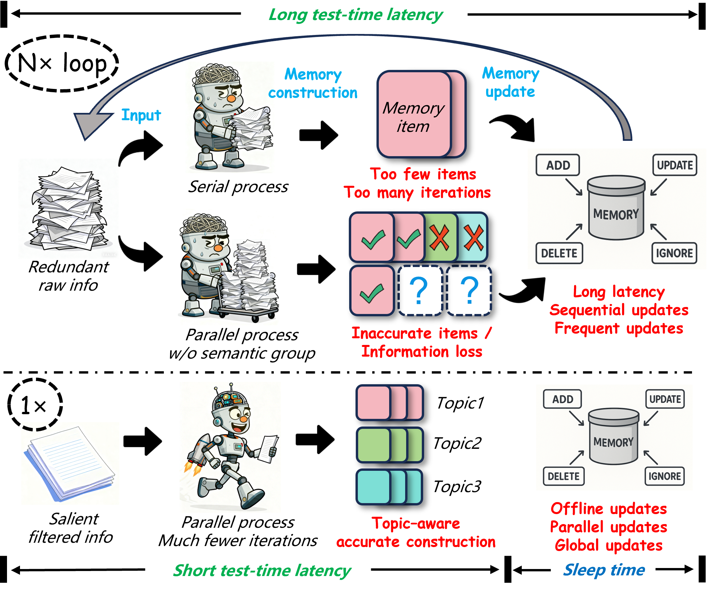

<div align=center></div>
<h1 align="center"> LightMem </h1>

<p align="center">
  <a href="https://arxiv.org/abs/2510.18866">
    
  </a>
  <a href="https://github.com/zjunlp/LightMem">
    
  </a>
  <a href="https://github.com/zjunlp/LightMem/blob/main/LICENSE">
    
  </a>
  
  
</p>

<h5 align="center"> ⭐ If you like our project, please give us a star on GitHub for the latest updates!</h5>

---

<div align=center></div>

**LightMem** is a lightweight and efficient memory management framework designed for Large Language Models and AI Agents. It provides a simple yet powerful memory storage, retrieval, and update mechanism to help you quickly build intelligent applications with long-term memory capabilities.

- **Paper**: https://arxiv.org/abs/2510.18866
- **GitHub**: https://github.com/zjunlp/LightMem

<span id='features'/>

## ✨ Key Features

* 🚀 **Lightweight & Efficient**
  <br> Minimalist design with minimal resource consumption and fast response times

* 🎯 **Easy to Use**
  <br> Simple API design - integrate into your application with just a few lines of code

* 🔌 **Flexible & Extensible**
  <br> Modular architecture supporting custom storage engines and retrieval strategies

* 🌐 **Broad Compatibility**
  <br> Support for cloud APIs (OpenAI, DeepSeek) and local models (Ollama, vLLM, etc.)

<span id='news'/>

## 📢 News

- **[2025-10-12]**: 🎉 LightMem project is officially Open-Sourced!

<span id='todo'/>

## ☑️ Todo List
LightMem is continuously evolving! Here's what's coming:
    
- Offline Pre-computation of KV Cache for Update (Lossless)
- Online Pre-computation of KV Cache Before Q&A (Lossy)
- MCP (Memory Control Policy)
- Integration More Models and Feature Enhancement
- Coordinated Use of Context and Long-Term Memory Storage


<span id='contents'/>

## 📑 Table of Contents

* <a href='#features'>✨ Key Features</a>
* <a href='#news'>📢 News</a>
* <a href='#todo'>☑️ Todo List</a>
* <a href='#installation'>🔧 Installation</a>
* <a href='#quickstart'>⚡ Quick Start</a>
* <a href='#architecture'>🏗️ Architecture</a>
* <a href='#examples'>💡 Examples</a>
* <a href='#configuration'>⚙️ Configuration</a>
* <a href='#contributors'>👥 Contributors</a>
* <a href='#related'>🔗 Related Projects</a>

<span id='installation'/>

## 🔧 Installation

### Installation Steps

#### Option 1: Install from Source 
```bash
# Clone the repository
git clone https://github.com/zjunlp/LightMem.git
cd LightMem

# Create virtual environment
conda create -n lightmem python=3.10 -y
conda activate lightmem

# Install dependencies
unset ALL_PROXY
pip install -e .
```

#### Option 2: Install via pip
```bash
pip install lightmem  # Coming soon
```

## ⚡ Quick Start
```python
cd experiments
python run_lightmem_qwen.py
```

<span id='architecture'/>

## 🏗️ Architecture

### 🗺️ Core Modules Overview
LightMem adopts a modular design, breaking down the memory management process into several pluggable components. The core directory structure exposed to users is outlined below, allowing for easy customization and extension:

```python
LightMem/
├── src/lightmem/            # Main package
│   ├── __init__.py          # Package initialization
│   ├── configs/             # Configuration files
│   ├── factory/             # Factory methods
│   ├── memory/              # Core memory management
│   └── memory_toolkits/     # Memory toolkits
├── experiments/             # Experiment scripts
├── datasets/                # Datasets files
└── examples/                # Examples
```

### 🧩 Supported Backends per Module

The following table lists the backends values currently recognized by each configuration module. Use the `model_name` field (or the corresponding config object) to select one of these backends.

| Module (config)                 | Supported backends |
| :---                            | :--- |
| `PreCompressorConfig`           | `llmlingua-2`, `entropy_compress` |
| `TopicSegmenterConfig`          | `llmlingua-2` |
| `MemoryManagerConfig`           | `openai`, `deepseek`, `ollama`, `vllm`, etc. |
| `TextEmbedderConfig`            | `huggingface` |
| `MMEmbedderConfig`              | `huggingface` |
| `EmbeddingRetrieverConfig`      | `qdrant` |

<span id='examples'/>

## 💡 Examples

### Initialize LightMem
```python
"""
Start at root directory or anywhere
"""

import os
import datetime
from lightmem.memory.lightmem import LightMemory


LOGS_ROOT = "./logs"
RUN_TIMESTAMP = datetime.datetime.now().strftime("%Y%m%d_%H%M%S")
RUN_LOG_DIR = os.path.join(LOGS_ROOT, RUN_TIMESTAMP)
os.makedirs(RUN_LOG_DIR, exist_ok=True)

API_KEY='your_api_key'
API_BASE_URL='your_api_base_url'
LLM_MODEL='your_model_name' # such as 'gpt-4o-mini' (API) or 'gemma3:latest' (Local Ollama) ...
EMBEDDING_MODEL_PATH='/your/path/to/models/all-MiniLM-L6-v2'
LLMLINGUA_MODEL_PATH='/your/path/to/models/llmlingua-2-bert-base-multilingual-cased-meetingbank'

config_dict = {
    "pre_compress": True,
    "pre_compressor": {
        "model_name": "llmlingua-2",
        "configs": {
            "llmlingua_config": {
                "model_name": LLMLINGUA_MODEL_PATH,
                "device_map": "cuda",
                "use_llmlingua2": True,
            },
        }
    },
    "topic_segment": True,
    "precomp_topic_shared": True,
    "topic_segmenter": {
        "model_name": "llmlingua-2",
    },
    "messages_use": "user_only",
    "metadata_generate": True,
    "text_summary": True,
    "memory_manager": {
        "model_name": 'xxx', # such as 'openai' or 'ollama' ...
        "configs": {
            "model": LLM_MODEL,
            "api_key": API_KEY,
            "max_tokens": 16000,
            "xxx_base_url": API_BASE_URL # API model specific, such as 'openai_base_url' or 'deepseek_base_url' ...
        }
    },
    "extract_threshold": 0.1,
    "index_strategy": "embedding",
    "text_embedder": {
        "model_name": "huggingface",
        "configs": {
            "model": EMBEDDING_MODEL_PATH,
            "embedding_dims": 384,
            "model_kwargs": {"device": "cuda"},
        },
    },
    "retrieve_strategy": "embedding",
    "embedding_retriever": {
        "model_name": "qdrant",
        "configs": {
            "collection_name": "my_long_term_chat",
            "embedding_model_dims": 384,
            "path": "./my_long_term_chat", 
        }
    },
    "update": "offline",
    "logging": {
        "level": "DEBUG",
        "file_enabled": True,
        "log_dir": RUN_LOG_DIR,
    }
}

lightmem = LightMemory.from_config(config_dict)
```

### Add Memory
```python

### Add Memory
session = {
"timestamp": "2025-01-10",
"turns": [
    [
        {"role": "user", "content": "My favorite ice cream flavor is pistachio, and my dog's name is Rex."}, 
        {"role": "assistant", "content": "Got it. Pistachio is a great choice."}], 
    ]
}


for turn_messages in session["turns"]:
    timestamp = session["timestamp"]
    for msg in turn_messages:
        msg["time_stamp"] = timestamp
        
    store_result = lightmem.add_memory(
        messages=turn_messages,
        force_segment=True,
        force_extract=True
    )
```

### Offline Update
```python
lightmem.construct_update_queue_all_entries()
lightmem.offline_update_all_entries(score_threshold=0.8)
``` 

### Retrieve Memory
```python
question = "What is the name of my dog?"
related_memories = lightmem.retrieve(question, limit=5)
print(related_memories)
``` 

## 📁 Experimental Results

For transparency and reproducibility, we have shared the results of our experiments on Google Drive. This includes model outputs, evaluation logs, and predictions used in our study.

🔗 Access the data here: [Google Drive - Experimental Results](https://drive.google.com/drive/folders/1n1YCqq0aDeWiPILhkq-uS3sU3FDmslz9?usp=drive_link)

Please feel free to download, explore, and use these resources for research or reference purposes.

<span id='configuration'/>

## ⚙️ Configuration

All behaviors of LightMem are controlled via the BaseMemoryConfigs configuration class. Users can customize aspects like pre-processing, memory extraction, retrieval strategy, and update mechanisms by providing a custom configuration.
#### Key Configuration Options (Usage)

| Option                    | Default                                     | Usage (allowed values and behavior) |
| :---                      | :---                                        | :--- |
| `pre_compress`        | `False`                                     | True / False. If True, input messages are pre-compressed using the `pre_compressor` configuration before being stored. This reduces storage and indexing cost but may remove fine-grained details. If False, messages are stored without pre-compression. |
| `pre_compressor`      | `None`                                      | dict / object. Configuration for the pre-compression component (`PreCompressorConfig`) with fields like `model_name` (e.g., `llmlingua-2`, `entropy_compress`) and `configs` (model-specific parameters). Effective only when `pre_compress=True`. |
| `topic_segment`       | `False`                                     | True / False. Enables topic-based segmentation of long conversations. When True, long conversations are split into topic segments and each segment can be indexed/stored independently (requires `topic_segmenter`). When False, messages are stored sequentially. |
| `precomp_topic_shared`| `False`                                     | True / False. If True, pre-compression and topic segmentation can share intermediate results to avoid redundant processing. May improve performance but requires careful configuration to avoid cross-topic leakage. |
| `topic_segmenter`     | `None`                                      | dict / object. Configuration for topic segmentation (`TopicSegmenterConfig`), including `model_name` and `configs` (segment length, overlap, etc.). Used when `topic_segment=True`. |
| `messages_use`        | `'user_only'`                               | `'user_only'` / `'assistant_only'` / `'hybrid'`. Controls which messages are used to generate metadata and summaries: `user_only` uses user inputs, `assistant_only` uses assistant responses, `hybrid` uses both. Choosing `hybrid` increases processing but yields richer context. |
| `metadata_generate`   | `True`                                      | True / False. If True, metadata such as keywords and entities are extracted and stored to support attribute-based and filtered retrieval. If False, no metadata extraction occurs. |
| `text_summary`        | `True`                                      | True / False. If True, a text summary is generated and stored alongside the original text (reduces retrieval cost and speeds review). If False, only the original text is stored. Summary quality depends on `memory_manager`. |
| `memory_manager`      | `MemoryManagerConfig()`                     | dict / object. Controls the model used to generate summaries and metadata (`MemoryManagerConfig`), e.g., `model_name` (`openai`, `ollama`, etc.) and `configs`. Changing this affects summary style, length, and cost. |
| `extract_threshold`   | `0.5`                                       | float (0.0 - 1.0). Threshold used to decide whether content is important enough to be extracted as metadata or highlight. Higher values (e.g., 0.8) mean more conservative extraction; lower values (e.g., 0.2) extract more items (may increase noise). |
| `index_strategy`      | `None`                                      | `'embedding'` / `'context'` / `'hybrid'` / `None`. Determines how memories are indexed: 'embedding' uses vector-based indexing (requires embedders/retriever) for semantic search; 'context' uses text-based/contextual retrieval (requires context_retriever) for keyword/document similarity; and 'hybrid' combines context filtering and vector reranking for robustness and higher accuracy.
| `text_embedder`       | `None`                                      | dict / object. Configuration for text embedding model (`TextEmbedderConfig`) with `model_name` (e.g., `huggingface`) and `configs` (batch size, device, embedding dim). Required when `index_strategy` or `retrieve_strategy` includes `'embedding'`. |
| `multimodal_embedder` | `None`                                      | dict / object. Configuration for multimodal/image embedder (`MMEmbedderConfig`). Used for non-text modalities. |
| `history_db_path`     | `os.path.join(lightmem_dir, "history.db")`  | str. Path to persist conversation history and lightweight state. Useful to restore state across restarts. |
| `retrieve_strategy`   | `'embedding'`                               | `'embedding'` / `'context'` / `'hybrid'`. Strategy used at query time to fetch relevant memories. Pick based on data and query type: semantic queries -> `'embedding'`; keyword/structured queries -> `'context'`; mixed -> `'hybrid'`. |
| `context_retriever`   | `None`                                      | dict / object. Configuration for context-based retriever (`ContextRetrieverConfig`), e.g., `model_name='BM25'` and `configs` like `top_k`. Used when `retrieve_strategy` includes `'context'`. |
| `embedding_retriever` | `None`                                      | dict / object. Vector store configuration (`EmbeddingRetrieverConfig`), e.g., `model_name='qdrant'` and connection/index params. Used when `retrieve_strategy` includes `'embedding'`. |
| `update`              | `'offline'`                                 | `'online'` / `'offline'`. `'online'`: update memories immediately after each interaction (low latency for fresh memories but higher operational cost). `'offline'`: batch or scheduled updates to save cost and aggregate changes. |
| `kv_cache`            | `False`                                     | True / False. If True, attempt to precompute and persist model KV caches to accelerate repeated LLM calls (requires support from the LLM runtime and may increase storage). Uses `kv_cache_path` to store cache. |
| `kv_cache_path`       | `os.path.join(lightmem_dir, "kv_cache.db")` | str. File path for KV cache storage when `kv_cache=True`. |
| `graph_mem`           | `False`                                     | True / False. When True, some memories will be organized as a graph (nodes and relationships) to support complex relation queries and reasoning. Requires additional graph processing/storage. |
| `version`             | `'v1.1'`                                    | str. Configuration/API version. Only change if you know compatibility implications. |
| `logging`             | `'None'`                                    | dict / object. Configuration for logging enabled. |

## 🏆 Contributors

<table>
  <tr>
    <td align="center" width="120">
      <a href="https://github.com/JizhanFang">
        
        <br />
        <sub><b>JizhanFang</b></sub>
      </a>
    </td>
    <td align="center" width="120">
      <a href="https://github.com/Xinle-Deng">
        
        <br />
        <sub><b>Xinle-Deng</b></sub>
      </a>
    </td>
    <td align="center" width="120">
      <a href="https://github.com/Xubqpanda">
        
        <br />
        <sub><b>Xubqpanda</b></sub>
      </a>
    </td>
    <td align="center" width="120">
      <a href="https://github.com/HaomingX">
        
        <br />
        <sub><b>HaomingX</b></sub>
      </a>
    </td>
    <td align="center" width="120">
      <a href="https://github.com/James-TYQ">
        
        <br />
        <sub><b>James-TYQ</b></sub>
      </a>
    </td>
    <td align="center" width="120">
      <a href="https://github.com/evy568">
        
        <br />
        <sub><b>evy568</b></sub>
      </a>
    </td>
    <td align="center" width="120">
      <a href="https://github.com/Norah-Feathertail">
        
        <br />
        <sub><b>Norah-Feathertail</b></sub>
      </a>
    </td>
  </tr>
</table>
We welcome contributions from the community! If you'd like to contribute, please fork the repository and submit a pull request. For major changes, please open an issue first to discuss what you would like to change.

<span id='related'/>

## 🔗 Related Projects

<div align="center">
  <table>
    <tr>
      <td align="center" width="150">
        <a href="https://github.com/mem0ai/mem0">
          
          <br />
          <sub><b>Mem0</b></sub>
        </a>
      </td>
      <td align="center" width="150">
        <a href="https://github.com/usememos/memos">
          
          <br />
          <sub><b>Memos</b></sub>
        </a>
      </td>
      <td align="center" width="150">
        <a href="https://github.com/getzep/zep">
          
          <br />
          <sub><b>Zep</b></sub>
        </a>
      </td>
      <td align="center" width="150">
        <a href="https://github.com/Mirix-AI/MIRIX">
          
          <br />
          <sub><b>MIRIX</b></sub>
        </a>
      </td>
      <td align="center" width="150">
        <a href="https://github.com/NevaMind-AI/memU">
          
          <br />
          <sub><b>MemU</b></sub>
        </a>
      </td>
      <td align="center" width="150">
        <a href="https://github.com/memodb-io/memobase">
          
          <br />
          <sub><b>Memobase</b></sub>
        </a>
      </td>
    </tr>
  </table>
</div>
