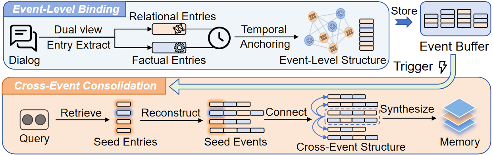

<h1 align="center"> StructMem: Structured Memory for Long-Horizon Behavior in LLMs </h1>

---

**StructMem**, a structure-enriched hierarchical memory framework that preserves event-level bindings and induces cross-event connections. By temporally anchoring dual perspectives and performing periodic semantic consolidation, StructMem improves temporal reasoning and multi-hop performance.

<div align=center></div>

## Key Contributions

### 1. Event-Level Extraction Mode

StructMem introduces an **event extraction mode** that goes beyond flat factual entries by capturing:

- **Factual components**: Core information units (who, what, when, where)
- **Relational components**: Interpersonal dynamics, causal influences, and temporal dependencies. 
- **Temporal binding**: Event sequences and causal relationships

This mode is particularly effective for narrative-heavy conversations and time-sensitive scenarios.

**Usage:**
```python
config = {
    # ... other configs ...
    "extraction_mode": "event",  # 'flat' or 'event'
    # ... other configs ...
}
```

### 2. Cross-Event Summarization

StructMem implements a **hierarchical summarization mechanism** that:

- **Semantic Event Connections**: Buffers related events within time windows
- **Memory Consolidation through Synthesis**: Generates cross-event summaries stored separately from detailed memories

**Usage:**
```python
# Generate summaries after building memories
summary_result = lightmem.summarize(
    retrieval_scope="global",
    time_window=3600,      # seconds
    top_k=15,              # number of seed memories
    process_all=True
)
```

**Configuration:**
```python
config = {
    # ... other configs ...
    "summary_retriever": {
        "model_name": "qdrant",
        "configs": {
            "collection_name": "my_summaries",
            "embedding_model_dims": 384,
            "path": "./my_summaries",
        }
    },
    # ... other configs ...
}
```

## Usage Example

See the complete example in [`experiments/locomo/`](./experiments/locomo/) for building and evaluating StructMem on the LoCoMo dataset.

### Quick Start
```python
from lightmem.memory.lightmem import LightMemory

# Configure StructMem
config = {
    # ... base LightMem configs ...
    
    # StructMem-specific settings
    "extraction_mode": "event",
    "summary_retriever": {
        "model_name": "qdrant",
        "configs": {
            "collection_name": "my_summaries",
            "embedding_model_dims": 384,
            "path": "./my_summaries",
        }
    },
    # ... other configs ...
}

# Initialize
lightmem = LightMemory.from_config(config)

# Add memories with event extraction, providing both factual and relational prompts.
lightmem.add_memory(
    messages=turn_messages,
    METADATA_GENERATE_PROMPT={
        "factual": LoCoMo_Event_Binding_factual,
        "relational": LoCoMo_Event_Binding_relational
    },
    force_segment=True,
    force_extract=True
)

# Generate cross-event summaries
lightmem.summarize(
    retrieval_scope="global",
    time_window=3600,
    top_k=15,
    process_all=True
)
```


## Experimental Results

StructMem demonstrates improved performance on long-context conversation benchmarks. For complete results and configurations, see [LoCoMo Results](./experiments/locomo/readme.md#structmem-results)
